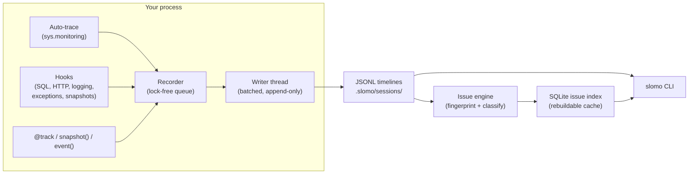

slomo has four moving parts. Understanding them explains every behavior you'll see in the CLI.



## 1. The recorder

Calling `enable()` starts a **session** for the current process and installs the hooks. It is idempotent and completes in under 5 ms (enforced by a test).

Every recorded activity is one [**event**](/concepts/sessions-and-events) — a timestamped, typed record with a payload. Producers (hooks, auto-trace, your `snapshot()`/`event()` calls) push events onto a single in-process queue; a background writer thread batches them to disk every 0.5 s (configurable).

The recorder is engineered to be invisible:

- **One queue put** is the entire cost on your code path.
- **Backpressure drops, never blocks** — if the queue fills (default 10,000 events), low-severity events are dropped rather than stalling your app.
- **Exception-isolated hooks** — a bug in a hook can never propagate into your application.
- **Stdlib-only hot path** — the recorder imports none of the CLI's dependencies.

## 2. The hooks

With `hooks=True` (the default), `enable()` installs:

| Hook | Captures |
|---|---|
| **Auto-trace** | Every function call in project code: enter, args, exit, result, duration, escaping exceptions — via `sys.monitoring` (PEP 669) |
| **Exceptions** | Unhandled exceptions on the main thread, worker threads, and unraisable errors — with structured tracebacks |
| **Snapshots** | Local variables from the top frames of a crashing stack (default 5 frames) |
| **SQL** | `sqlite3` natively; everything else through SQLAlchemy's event API |
| **HTTP** | `requests` and `httpx` (sync + async), request/response pairs correlated |
| **Logging** | `logging` records at WARNING and above |

Each hook can be disabled individually in [configuration](/configuration/config-toml). [Auto-tracing](/recording/auto-tracing) has its own page — it's the flagship.

## 3. Storage

Everything lives under `.slomo/` next to your code:

```
.slomo/
  config.toml
  sessions/<timestamp>-<id>/
    metadata.json        # argv, cwd, python version, host, pid, exit status
    timeline.jsonl       # the event stream — source of truth
    snapshots/           # oversized variable captures
    attachments/
  issues/index.sqlite    # derived, rebuildable
  exports/
  cache/
```

Two properties matter:

<AccordionGroup>
  <Accordion title="JSONL is the source of truth; SQLite is a cache">
    Timelines are append-only JSON Lines. The SQLite issue index is **derived** from them and can always be rebuilt with `slomo stats --rebuild-index`. Delete the index and nothing is lost.
  </Accordion>
  <Accordion title="Crash-safety is structural">
    Append-only writes, fsync on the crash path, and a reader that tolerates a truncated final line mean a `kill -9` loses at most one partial event. The crash that killed your process is exactly the event slomo fsyncs hardest.
  </Accordion>
</AccordionGroup>

One writer process owns a session directory at a time — each process records its own session. Forked children start their own session, labeled with `forked_from`, so multi-process apps (gunicorn workers, multiprocessing pools) just work. See [Storage layout](/configuration/storage-layout).

## 4. The issue engine

A crash is **not** an issue — it's an *incident*. When the CLI reads timelines, incidents are:

1. **Fingerprinted** — exception type + normalized stack + normalized message, with line numbers and volatile identifiers excluded, so the same bug tomorrow produces the same fingerprint.
2. **Grouped** — identical fingerprints land in one issue (`SM-<fingerprint[:8]>`) with `occurrences += 1`.
3. **Classified** — automatic category (Null Reference, Network, Database, Timeout, …), severity, stability (one-time / intermittent / recurring), and a confidence score.

`slomo doctor` then walks the timeline backwards from an incident to build a heuristic root-cause diagnosis. The full lifecycle — resolve, auto-reopen, related issues — is covered in [How issues work](/concepts/issues).

## What runs where

| Component | Runs in | Dependencies |
|---|---|---|
| Recorder + hooks | Your application process | stdlib only |
| Writer thread | Your application process (background) | stdlib only |
| Issue engine, CLI, replay | The `slomo` CLI process | `typer`, `rich` |

The split is deliberate: your app pays for recording only; all analysis cost lives in the CLI, on your time.
