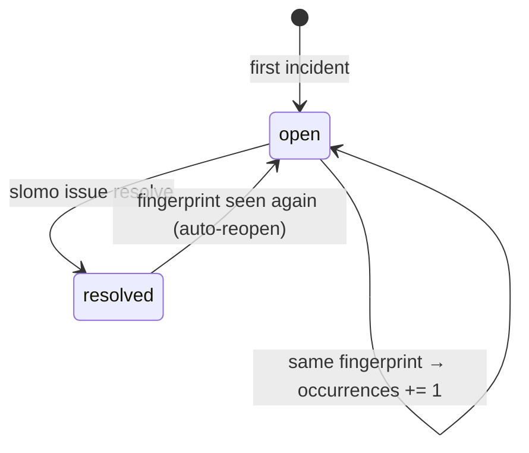

A crash is **not** an issue — it's an **incident**. An issue is a group of incidents that are the same underlying bug. This distinction is the difference between a signal and 500 duplicate alerts.

## Fingerprinting

Every incident is fingerprinted from:

- the **exception type**
- the **normalized stack** — your project frames, with line numbers excluded
- the **normalized message** — volatile parts (ids, addresses, numbers) stripped

Line numbers are excluded deliberately: adding an unrelated line above a buggy function must not create a "new" bug. Volatile message parts are stripped so `TimeoutError: request 8f3a timed out` and `TimeoutError: request 77bc timed out` group together.

The issue id is derived from the fingerprint: `SM-<fingerprint[:8]>`, e.g. `SM-8b6f710a`. Identical bugs produce identical ids — across runs, across days, across machines.

<Note>
Near-miss crashes (similar but not identical fingerprints) are surfaced as **"possibly related"** in `slomo issue show` — never auto-merged. Grouping errors are worse than duplicate issues, so slomo only groups on exact fingerprint matches.
</Note>

## Classification

Each issue is automatically classified with a **category**, **severity**, and **confidence** score, using heuristics over the exception type, module, and message:

| Category | Typical trigger |
|---|---|
| Null Reference | `TypeError`/`AttributeError` involving `NoneType` (95% confidence) |
| Timeout | timeout-shaped messages, `TimeoutError`, `ConnectTimeout`, `ReadTimeout` |
| Database | `sqlite3`/`psycopg`/`sqlalchemy`/… modules, `OperationalError`, `IntegrityError`, … |
| Network | socket/`requests`/`httpx`/ssl modules, `ConnectionError` family |
| Filesystem | `FileNotFoundError`, `IsADirectoryError`, … |
| Memory | `MemoryError` (critical severity) |
| Resource Exhaustion | `RecursionError`, "too many open files" (critical severity) |
| Dependency | `ModuleNotFoundError`, `ImportError` |
| Authentication | 401-shaped messages, "unauthorized", "invalid credentials" |
| Authorization | 403-shaped messages, `PermissionError`, "forbidden", "access denied" |
| Configuration | `KeyError` mentioning env/config/setting |
| Validation | `AssertionError`, `ValueError`, `*ValidationError` |
| Programming Error | `IndexError`, `KeyError`, `NameError`, `ZeroDivisionError`, … |
| Unknown | anything else (low confidence) |

The confidence score is shown by `slomo doctor` and `slomo issues` so you know how much to trust the label.

## Stability

Issues also carry a **stability** rating derived from their occurrence pattern:

- **one-time** — seen once
- **intermittent** — recurs irregularly
- **recurring** — keeps happening

`slomo issues` surfaces this so a recurring crash reads differently from a one-off.

## Lifecycle



```console
$ slomo issue resolve SM-8b6f710a    # mark fixed
$ slomo issue reopen SM-8b6f710a     # manual reopen
```

**Auto-reopen is the honesty mechanism**: if you mark an issue resolved and the same fingerprint ever appears again, the issue reopens itself. A "fixed" bug that comes back is not a new bug — and it won't be hiding in your resolved list.

## What an issue records

For each issue, slomo tracks: title, category, severity, status, stability, `occurrences`, `first_seen` / `last_seen`, `affected_sessions`, confidence, exception type, and the top stack frame. Every underlying incident keeps its own session, timestamp, and full traceback:

```console
$ slomo issue show SM-8b6f710a          # full detail + sample traceback
$ slomo issue occurrences SM-8b6f710a   # every recorded incident
$ slomo issue sessions SM-8b6f710a      # sessions affected
$ slomo issue timeline SM-8b6f710a      # latest incident's session timeline, focused on its trace
$ slomo issue explain SM-8b6f710a       # one-paragraph explanation (doctor-lite)
```

## The index is a cache

Issues live in `.slomo/issues/index.sqlite` — **derived** from the JSONL timelines, never authoritative. If it's ever stale or corrupt:

```bash
slomo stats --rebuild-index
```

rebuilds it from scratch. Deleting sessions removes their incidents from the rebuilt index; nothing else changes.

## Next

<CardGroup cols={2}>
  <Card title="The investigation workflow" icon="magnifying-glass" href="/investigating/issues-workflow">
    From `slomo issues` to a diagnosis with `doctor`.
  </Card>
  <Card title="Replay a crash" icon="clapperboard" href="/investigating/replay">
    Step through the recorded execution.
  </Card>
</CardGroup>
